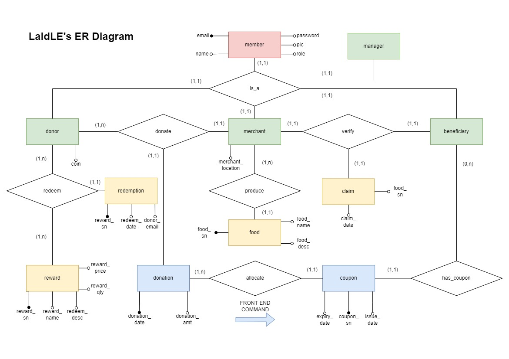

# LaidLE

## [Visit LaidLE Here!](https://laidle.herokuapp.com/ "The LaidLE Website")

LaidLE is a Full-Stack CRUD webapp for a meal-crowdfunding social enterprise project, aiming to alleviate some of the challenges faced by the ones that fall between the cracks of society. 

As a donor, you can easily donate at our partnered food merchants in order to fund the next meal for our beneficiaries either anonymously or as a LaidLE Friend and collect LaidLE Coins to redeem rewards at our shop!

You can also donate through our partnered merchants by scanning their QR Codes (example below)!

## LaidLE Features
### Full Entity Relationship Model

### 4 Fully-Featured User Groups
* Donors
  * Donations will be tagged to logged in donors
  * Donations will be converted to Coins
  * Coins can be spent on a variety of rewards
  * Redeeming a reward generates a QR Code using the reward's serial number for real-world usage
* Beneficiaries
  * Monthly donations will be allocated to beneficiaries
  * Allocation priority will be the last beneficiaries to receive a coupon followed by their household income
  * Coupons can be used to redeem for meals set up by our partnered merchants
  * Meal items from merchants in the same location as the beneficiary will be shown first
  * Redeeming a coupon generates a unique QR Code using the coupon's serial number for real-world usage
* Merchants
  * Merchants can view/add/edit/delete their stall items easily
* Managers (Admins)
  * Managers can manage all relevant database tables
  * Only managers can onboard new beneficiaries and merchants after vetting by LaidLE
  * Some tables are read-only to prevent abuse, such as those handling money
  * The rest are able to be added/edited/deleted upon
  * Managers are also in charge of allocating coupons to beneficiaries using the previous month's donation pool after verifying the month's donations

### Other Notable Features
* Fully mobile-responsive since LaidLE is primarily targetting mobile users with abundant QR Code integration
* Home page shows aggregated top donors for donor incentivisation
* Donations can either be from an anonymous or non-anonymous donor, to an anonymous or non-anonymous merchant
* Session-based authorisation with custom authentication decorators, storing only hashed passwords in the database
* All database operations performed using raw SQL (project requirements) instead of ORM
* All integrity constraints, raw SQL schema design and demo population code can be found in the folder `/sql`

### Demo User Login Credentials (Email/Password)
* Random Donor
  * `asimonnet3@liveinternet.ru`
  * `cMTDFyRJ`
* Rich Donor
  * `akupker1@state.tx.us`
  * `M6tOaamSFND8`
* Beneficiary with 0 Coupons
  * `kdeetch5@stumbleupon.com`
  * `fLCbXW2R`
* Beneficiary with 1 Coupon
  * `dshelmerdine0@list-manage.com`
  * `dtxBZCum`
* Merchant
  * `malaysian@google.com.au`
  * `8K0CN0I`
* Manager (Please don't delete everything!)
  * `manager@manager.com`
  * `manager`

## Team Members
1. Tam Zher Min (Full-Stack Django/Bootstrap Website)
2. Elisha Lee (SQL Code & Schema Design)
3. Weldon Chue (Video Presentation)
4. Tran Minh Hoang (Video Presentation)